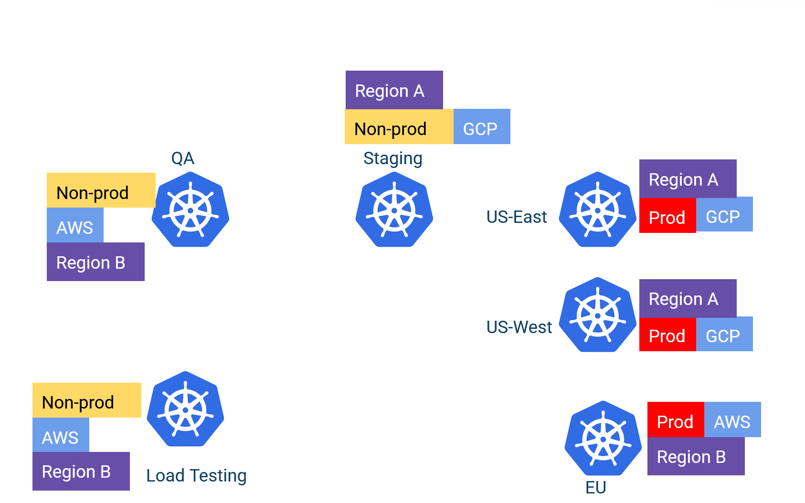
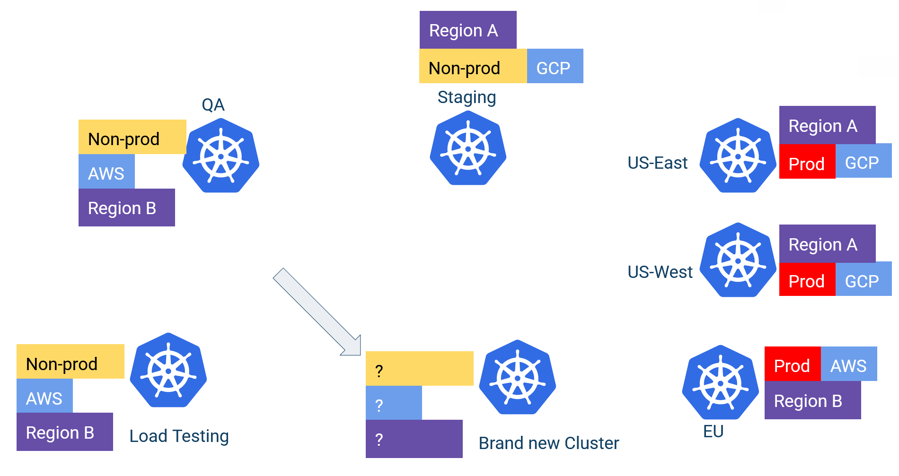

# Working with cluster groups instead of individual clusters

In a large organization, you don’t really care about individual clusters. You care about cluster groups. Argo CD doesn’t model the concept of a cluster group on its own, but you can replicate it using cluster labels.

You need to spend some time thinking about the different types of clusters you have and then assign labels to them.

The labels can be anything that makes sense to your organization

- Environment types (for example, QA/staging/prod)
- Regions or countries
- Department or teams
- Cloud provider or other technical difference
- Any other special configuration that distinguishes one or more clusters from the rest

After you have those labels, you can slice and dice your cluster across any dimension and start thinking about cluster groups instead of individual cluster labels.

Because, ultimately, 99% of use cases resolve around cluster groups rather than individual clusters.

- “I want all my production clusters to have application X with Y settings.”
- “I want all my AWS clusters to have X authentication enabled.”
- “Team X will control this environment while team Y will control that environment.”
- “All European clusters need this application.”
- “Application X is installed on both US-East and US-West regions, but with different configurations.”
- “Just for our QA environment, we need this load testing app deployed.”

We’ll see in detail all the advantages when using cluster labels, but one of the easiest ways to understand the flexibility of this approach is to examine what happens for a very common scenario—adding a brand new cluster.

In most cases, a new cluster is “similar” to another cluster. A human operator needs to “clone” an existing cluster, or at the very least, define the new properties of the new cluster in the configuration file.

If you use cluster labels (as we suggest), the whole process requires zero modifications to your application set files.

1. You create the cluster with your favorite infra tool (Terraform/Pulumi/Crossplane, etc)
1. You assign the labels on this cluster (for example, it’s a new QA cluster in US East)
1. Finished!

Argo CD automatically detects this new cluster when it collects all its clusters, and deploys everything that needs to be deployed in the cluster according to its labels. There’s no configuration file to edit to “enable/deactivate” your apps. The process cannot get any easier than this.

Read the full blog post at [https://codefresh.io/blog/argocd-clusters-labels-with-apps/](https://codefresh.io/blog/argocd-clusters-labels-with-apps/)
